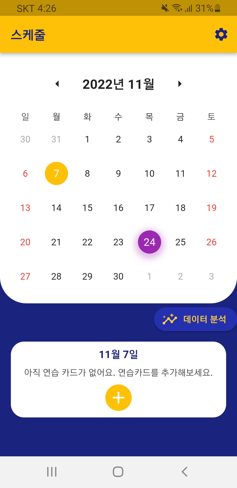
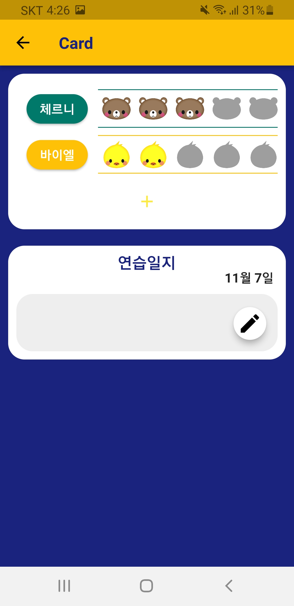
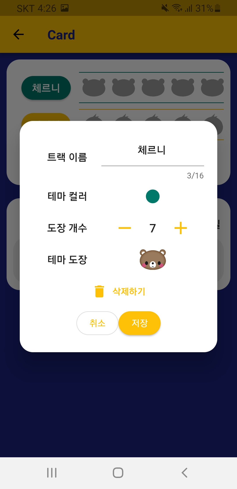
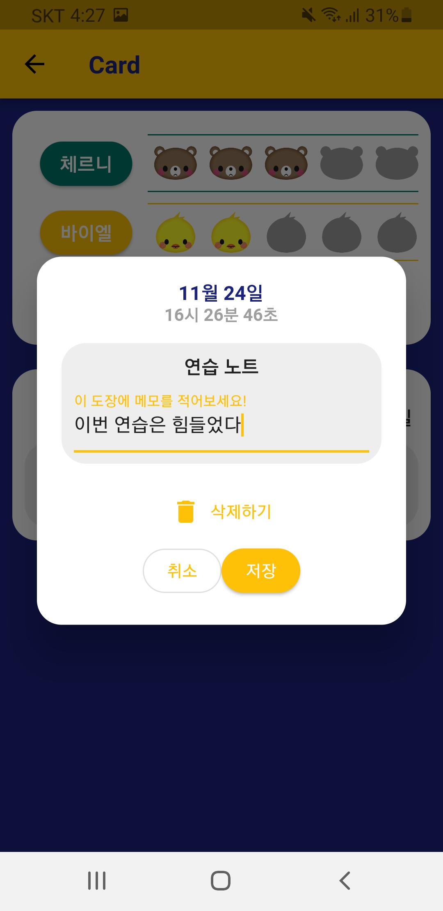
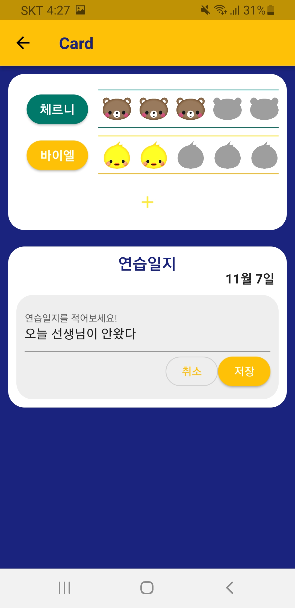
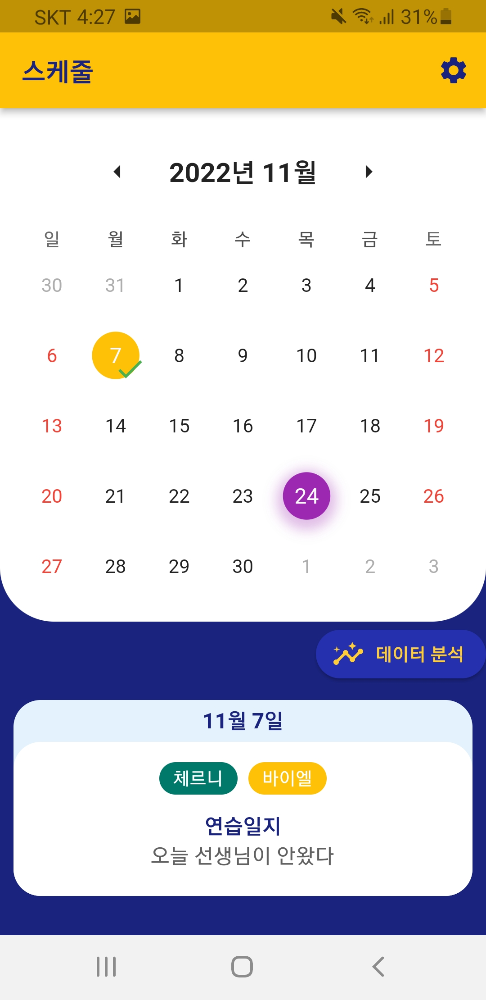
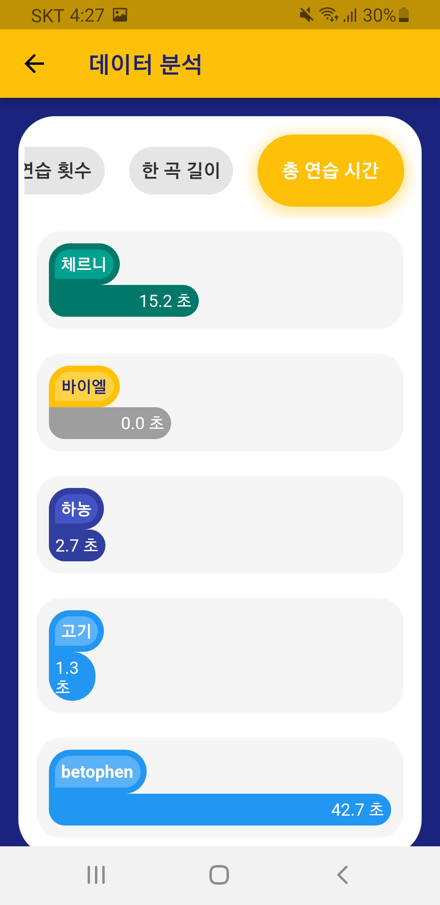
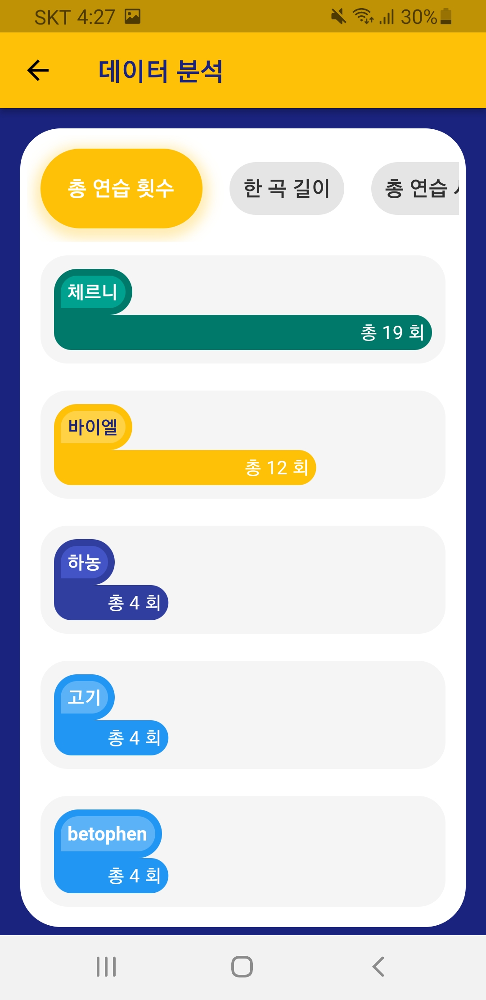
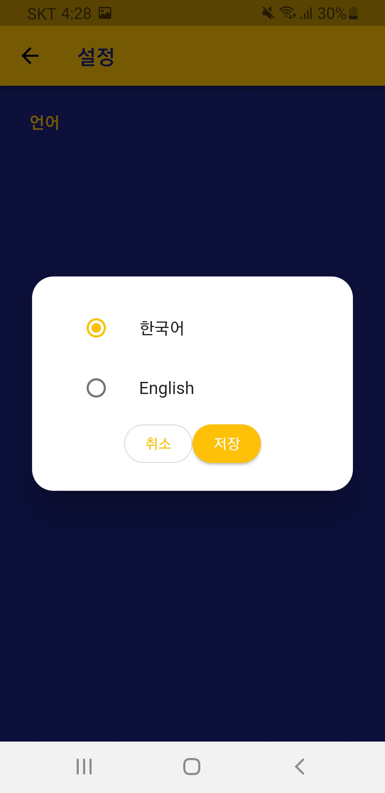

# LessonCard 

*Nov 16th, 2021*

피아노학원에서 레슨카드 기록해본 경험을 앱으로 구현해봤어요.
 
플러터 공부용으로 만든 앱이라 정돈되지 않았을 수 있어요.

 
 

# 앱 기능

### 날짜 선택
앱을 로드하면 캘린더에서 음악 연습을 진행하고자 하는 날짜를 선택할 수 있어요.
 

 
 

### 연습 카드
연습 카드 페이지에서는 피아노곡 트랙을 추가할 수 있어요.
 

 
 

### 트랙 커스터마이즈
트랙을 누르면 최대 스탬프 개수, 색깔, 스탬프 모양 등을 내가 원하는대로 선택할 수 있어요.
 

 
 

### 스탬프 기록
트랙에 스탬프들을 눌러서 연습을 기록할 수 있어요. 기록을 할 때는 연습 시간이 자동으로 기록되고 연습 노트를 추가할 수 있어요.
 

 
 

### 연습 일지 작성
연습을 마치고 카드마다 연습 일지를 기록해둘 수 있어요.
 

 
 

### 연습 요약
캘린더로 돌아오면 그 날 진행한 연습을 요약해서 보여줘요.
 

 
 

### 연습 분석
분석페이지에서는 피아노 교재 별 총 연습량, 한곡 평균 시간, 총 연습 시간 등을 보여줘요.
 

 
 

### 언어 설정
설정에서 영어와 한국어를 선택할 수 있어요.
 

 
 

